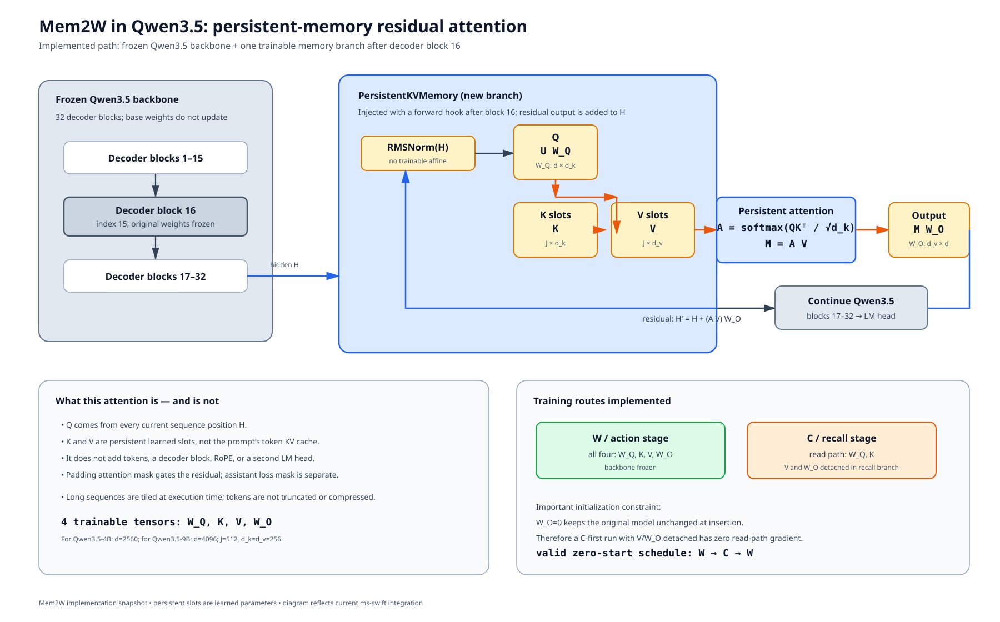

# 当前 Mem2W 结构图与方法定位



## 图中对应的实现

当前代码不是替换 Qwen3.5 的完整 Transformer block，也不是 LoRA。它在 Qwen3.5 的第 16 个 decoder block（代码索引 15）之后注册 forward hook，将一个持久记忆残差支路作用在该 block 的 hidden states 上：

```text
U = RMSNorm(H)
Q = U W_Q
A = softmax(Q Kᵀ / sqrt(d_k))
M = A V
H' = H + M W_O
```

其中 `K`、`V` 是 `J=512` 个可训练持久槽，不是输入序列的 token KV cache。当前 Qwen3.5-4B 的 `d=2560`；9B 配置为 `d=4096`；两者都使用 `d_k=d_v=256`。基础模型参数冻结，只训练 `W_Q/K/V/W_O`。

实现位置：

- [memory.py](../integrations/ms-swift/20260929/files/swift/mem2w/memory.py)：RMSNorm、persistent-slot attention、残差和分块计算；
- [integration.py](../integrations/ms-swift/20260929/files/swift/mem2w/integration.py)：第 16 层 hook、mask 传递和冻结；
- [dual_trainer.py](../integrations/ms-swift/20260929/files/swift/mem2w/dual_trainer.py)：W/C loss 与梯度路由。

## 与相关方法的关系

它最接近“冻结 backbone、增加少量可训练模块”的参数高效改造：adapter 方法把小模块插入 Transformer 层；prefix-tuning 则让 token attend 到可训练的 virtual prefix。Mem2W 的区别是：它不把持久记忆展开成输入 token，而是让当前 hidden states 直接对一组 learned K/V slots 做一次额外 attention，再通过 `W_O` 加回原 hidden states。持久 memory attention 的思想也与 Persistent Memory 类方法相近，但这里的读写参数、插入位置和 W/C 训练约束是本项目自己的实现。

参考：

- [Augmenting Self-attention with Persistent Memory](https://arxiv.org/abs/1907.01470)
- [Prefix-Tuning: Optimizing Continuous Prompts for Generation](https://arxiv.org/abs/2101.00190)
- [Parameter-Efficient Transfer Learning for NLP](https://arxiv.org/abs/1902.00751)
- [Qwen3.5-4B configuration](https://huggingface.co/Qwen/Qwen3.5-4B/blob/main/config.json)

## 一个需要明确的训练约束

`W_O` 当前为零初始化，目的是让模块刚插入时严格旁路原模型；这并不意味着没有梯度：W 阶段第一步可以更新 `W_O`。但如果 C 阶段同时 detach `V/W_O`，且尚未经过 W 阶段使 `W_O` 非零，则 Q/K 的梯度路径会被零矩阵截断。因此从零开始的当前实现使用 `W → C → W`；如果要坚持 `C → W → W`，需要重新定义 C 阶段是否允许更新 `W_O`，不能只改阶段顺序。
